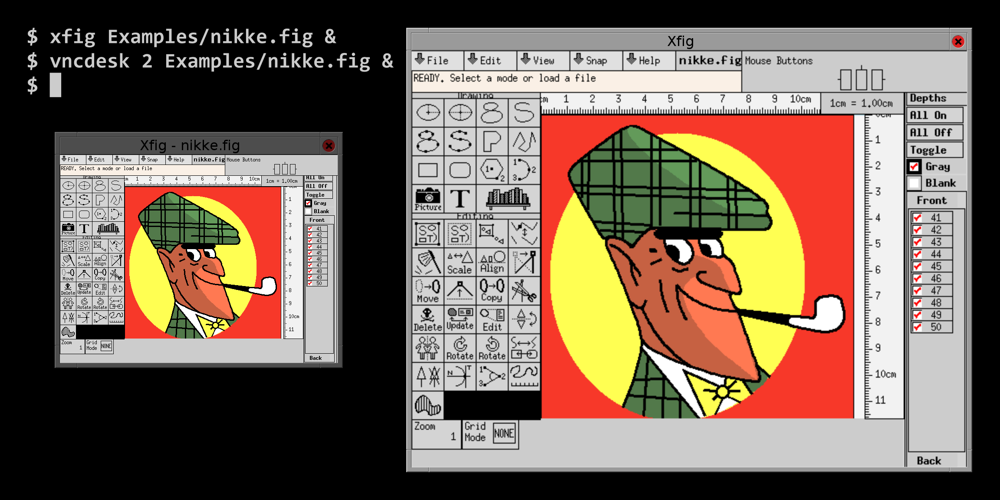

=======
Vncdesk
=======

*Vncdesk* was originally developed for scaling up applications on high DPI
screens. Applications run in VNC desktops.

Usage
=====

Configuration for each desktop goes into a numbered directory below
``~/.vncdesk``. For example the configuration in ``~/.vncdesk/2/`` can be run
with::

  vncdesk 2 Examples/nikke.fig

Optional arguments, here ``nikke.fig``, are passed to the startup script which
may pass it on to an application:

Files:

* ``settings.ini``, by example::

    [desktop]
    width = 1024
    height = 768
    depth = 24

    [window]
    title = Xfig
    name = xfig in vncdesk
    class = FigInVncdesk
    scale_factor = 2
    smoothing = false

  The option ``depth`` is optional, and so is the entire section ``window``.

  Consider that GDK 3 will also scale the VNC viewer via the environment
  variable ``GDK_SCALE``. You may want to disable GDK scaling in case you run
  into display errors.

  Set ``smoothing`` to ``false`` to get rid of blur when scaling. This option
  does not work with gtk-vnc release 0.6.0. It requires a gtk-vnc development
  version, or a newer release.

* ``startup``: Startup script. Environment variables provided:

  - ``WIDTH``, ``HEIGHT``: Desktop size.

  - ``DISPLAY``: Display of the VNC server.

  - ``GUEST_DISPLAY``: Display of the VNC client.

  - ``INVOCATION_DIR``: Directory in which ``vncdesk`` was started.

  - Arguments passed when calling ``vncdesk``.

  Examples:

  - Xfig_ in full screen mode::

      #!/bin/sh
      xrdb -merge Xresources
      cd "$INVOCATION_DIR"
      exec xfig -geometry ${WIDTH}x$HEIGHT+0+0 "$@"

  - Xfig in Fluxbox_ window manager::

      #!/bin/sh
      cd "$INVOCATION_DIR"
      exec fluxbox &
      xterm -e command

* Application specific files, for example ``Xresources``::

    xfig*image_editor: DISPLAY=$GUEST_DISPLAY xdg-open
    xfig*pdfviewer: DISPLAY=$GUEST_DISPLAY xdg-open
    xfig*browser: DISPLAY=$GUEST_DISPLAY xdg-open

* ``.password``: Generated every time anew, to password protect the connection
  also from other users on the same system.

Installation
============

1. Download a release_ from GitHub.

2. Install dependencies:

   - Python 3

   - A compatible VNC server such as TigerVNC_ 1.4 or TightVNC_ 1.3

   - gtk-vnc_ 0.5 or compatible, with the Python GTK+ 3 bindings

3. If you want to set up an explicit font path for the VNC server, at the same
   level as ``__init__.py`` create ``font_path.py``. Example contents::

     font_path = ','.join(['/usr/share/fonts/misc/',
                           '/usr/share/fonts/75dpi/',
                           '/usr/share/fonts/100dpi/',
                           '/usr/share/fonts/Type1/'])

4. Run with sufficient permissions::

     python setup.py install

   Or, if you have pip_::

     pip3 install .

Releasing a new version
=======================

* Test, e.g. by::

    pip3 install --upgrade --user .; ~/.local/bin/vncdesk 2

* Use versioning scheme: `major.minor.patch`_

* Set version in: ``vncdesk/version.py``

* Tag version in Git.

Coding convertions
==================

* Maximum line length: 80 characters

* Comments in reStructuredText.

License
=======

Except where noted otherwise, files are licensed under the WTFPL.

Copyright © 2015, 2016 `Felix E. Klee <mailto:felix.klee@inka.de>`_, with
contributions by `Robin Green <mailto:greenrd@greenrd.org>`_, and `Giorgio
<https://github.com/gbyolo>`_

This work is free. You can redistribute it and/or modify it under the terms of
the Do What The Fuck You Want To Public License, Version 2, as published by Sam
Hocevar. See the COPYING file for more details.

.. _release: https://github.com/feklee/vncdesk/releases
.. _TigerVNC: http://tigervnc.org/
.. _TightVNC: https://en.wikipedia.org/wiki/TightVNC
.. _major.minor.patch: http://semver.org/
.. _gtk-vnc: https://wiki.gnome.org/Projects/gtk-vnc
.. _Xfig: https://en.wikipedia.org/wiki/Xfig
.. _Fluxbox: https://en.wikipedia.org/wiki/Fluxbox
.. _pip: https://en.wikipedia.org/wiki/Pip_(package_manager)
